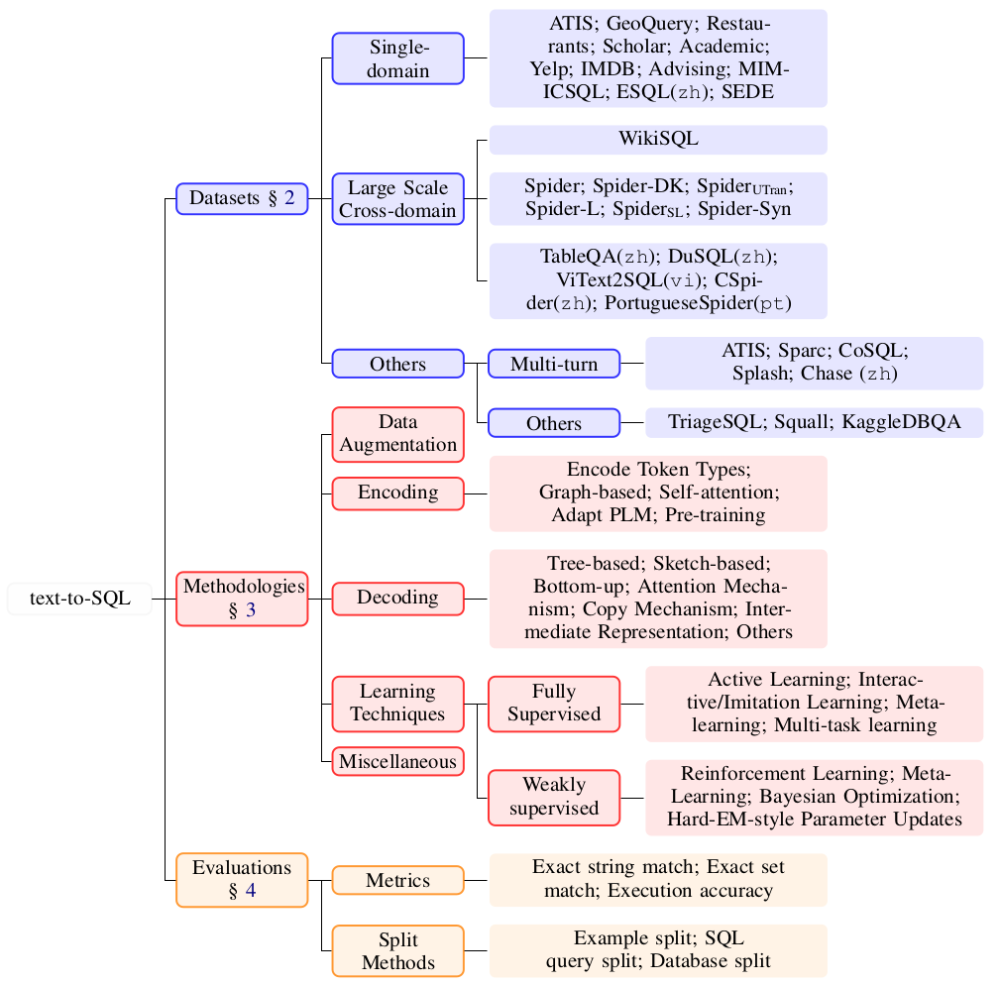
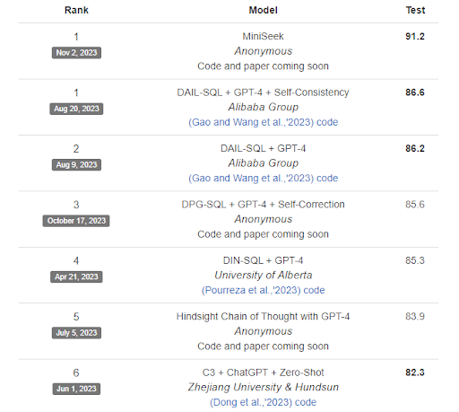
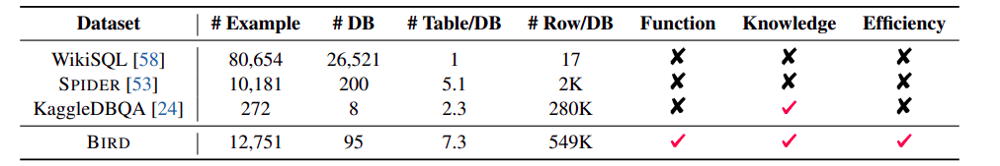
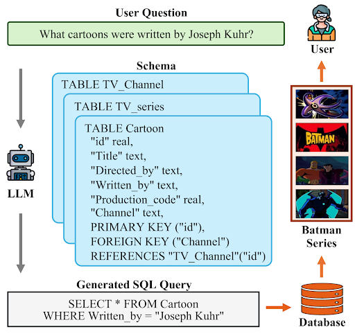

**The American University in Cairo**  
[Department of Computer Science and Engineering](https://sse.aucegypt.edu/academics/departments/computer-science-and-engineering)

---

**Advanced Machine Learning (Fall 2024\)**

**Text2SQL Generation**

**Fine-tuning DeepSeek-Coder1.3B on Enhanced Spider Datasets**

Dr. Moustafa Youssef

---

Fall 2024

Mohamed Abbas \- 900211252  
Youssef Mansoor \- 900212652

# **Introduction**

In today's Digital Revolution, data has become a crucial asset driving various human activities, from business to scientific research. However, the massive growth and complexity of data make it difficult for even experts to efficiently query and explore it. Current data query interfaces either use simple form-based methods, which are user-friendly but limited in functionality, or require knowledge of low-level database query languages like SQL, catering mainly to experts. To make data accessible and valuable to everyone, we need to remove the technical hurdles and reduce reliance on IT professionals. Enabling queries in natural language could democratize data access for all. Text-to-SQL technology has gained significant interest from researchers in natural language processing and database fields. Its importance stems from its ability to transform natural language meaning into SQL queries, enabling the creation of natural language interfaces for database systems.

# **Problem Statement**

\[2\] describes the Text-to-SQL as follows:

“Given a natural language query (NLQ) on a Relational Database (RDB) with a specific schema, produce a SQL query equivalent in meaning, which is valid for the said RDB and that when executed will return results that match the user’s intent.”

The core function of text-to-SQL is to convert natural language statements into executable SQL queries. Figure 1 shows an example. Given a user asks "What are the major cities in the state of Kansas?", the system generates a corresponding SQL query that can retrieve the relevant information from a database. This technology forms the foundation of natural language interfaces to databases (NLIDB), which allow non-expert users to easily access and query database information using everyday language \[1\]. Figure 2 shows the topology for the text-to-SQL \[1\] as of 2021\.

# **Motivation** 

Text-to-SQL Technology democratizes data access by allowing a broader range of users to perform data analysis and generate insights, thus expanding the potential user base beyond just technical experts. Use cases range across multiple domains including business analysis, customer support, academic research and healthcare.

In terms of the complexity for SQL queries, generally, models perform better on shorter SQL queries than longer SQL queries. \[3\] defines the SQL hardness as the number of SQL components. The SQL query is harder when it contains more SQL keywords such as GROUP BY and nested subqueries. The examples given by \[3\] are illustrated in figure 2, Appendix A. We will be working towards models that are at least capable of generating hard & extremely hard SQL queries.

# **Evaluation Metrics**

To evaluate model’s performance the common approach is to conduct a comprehensive metric  
analysis on the test set. Having a ground truth SQL query for each natural language query (NLQ) enables us to train and evaluate a deep learning text-to-SQL system on it. Evaluations Metrics Include:

* **Exact Set Match Accuracy (EM)** is determined by comparing the literal content of the generated SQL and the ground-truth SQL. Specifically, EM compares whether the SQL clauses of the generated SQL and the ground-truth SQL are consistent; that is if all component matches are correct (e.g. aggregation function, condition operators, SELECT columns, etc.). However, there are multiple ways to express the same SQL problem, so the EM metric often underestimates the prediction accuracy of the model.  
* **Execution Accuracy (EX)** is concluded by comparing the execution results of the generated SQL and the ground- truth SQL. However, SQL with different logic may yield the same results when executed, so EX may also overestimate the prediction accuracy of the model.

Other metrics are available, though EM and EX are the most relevant and widely used for evaluating text-to-SQL models.

# **Datasets & Benchmarks**

During our literature review, we identified many datasets frequently used in existing studies, each has distinct structural characteristics. Consequently, we will investigate each dataset individually to understand their unique features and implications for text-to-SQL applications.

![Table 1: Comparisons of text-to-SQL datasets. Spider is the only one text-to-SQL dataset that contains both databases with multiple tables in different domains and complex SQL queries [3]. 
](images/datasets.png)

Table 1: Comparisons of text-to-SQL datasets. Spider is the only one text-to-SQL dataset that contains both databases with multiple tables in different domains and complex SQL queries \[3\]. 

## Spider 

### Description 

Spider is a large-scale, cross-domain text-to-SQL dataset designed for complex SQL queries. It consists of 10,181 questions and 5,693 unique complex SQL queries across 200 databases with multiple tables, covering 138 distinct domains. The dataset is 917.34 MB in size, with 8,659 entries in the training set and 1,034 in the validation set, as shown in Table 1.. Spider was the first dataset in which different SQL queries and databases are used in the training and test sets. This setup requires models to generalize effectively to both unseen SQL queries and new database schemas. In various experiments with state-of-the-art models, as of the time for publishing the paper, the highest performance achieved was only 12.4% exact matching accuracy under a database split setting which suggests that Spider presented a significant challenge for further text-to-SQL research \[3\].  [Download](https://drive.google.com/file/d/1403EGqzIDoHMdQF4c9Bkyl7dZLZ5Wt6J/view?usp=sharing) a copy of the dataset (distributed under the [CC BY-SA 4.0 license](https://creativecommons.org/licenses/by-sa/4.0/legalcode)).

### Recent Progress

Spider 2.0 is a recent progress to advance code generation, focused on text-to-SQL. As per the developing team, this new benchmark is more realistic and offers challenging test of LLMs' performance in terms of complex enterprise-level text-to-SQL applications, involving complex data environments that may exceed 3000 columns, multiple SQL dialects such as BigQuery and Snowflake, and diverse operations like transformations and analytics. \[4\] Asserts that “even the most advanced LLMs, including GPT-4, solve only 6.0% of Spider 2.0 tasks, compared to 86.6% on Spider 1.0”

On August 28th, A smaller version of Spider 2.0 (\~25% of the full dataset) containing 190 examples was released to provide users with early access.The full dataset and the accompanying paper should be available in two weeks. Contrary to the official platform announcement, the full dataset is not yet released, however, if the stable version is released before our training phase, we will adopt the latest version. 

### Our Model on the Spider Benchmark

We evaluate our model on the spider benchmark Competing with State-of-the-Art Systems.

[Figure](https://yale-lily.github.io/spider). Current top-performing models on the Spider benchmark, with accuracy scores for SQL generation.

We plan to evaluate our model on the Spider benchmark, which is a widely used benchmark for Text-to-SQL tasks. The table shows the current state-of-the-art models that have been tested on this benchmark, including top performers like MiniSeek and DAIL-SQL with GPT-4. Our goal is to fine-tune our model and aim to reach the best accuracy on our limited computational resources. Achieving better results on the Spider benchmark would demonstrate our model's effectiveness in handling complex SQL generation tasks.

## WikiSQL

### Description

WikiSQL is a dataset containing 80,654 hand-annotated instances of natural language questions, SQL queries, and SQL tables, extracted from 24,241 HTML tables on Wikipedia, totaling 116 MB in size. It is divided into 8,294 validation instances, 56,143 for training, and 15,832 for testing. When it was first released, WikiSQL was the largest hand-annotated semantic parsing dataset. One limitation of WikiSQL is that each query involves only a single table, and the queries are relatively simple, lacking more complex keywords like JOIN, GROUP BY, and others \[[5](https://arxiv.org/pdf/1709.00103)\].

![igure 4: An example in WikiSQL. The inputs consist of a table and a question. The outputs consist of a ground truth SQL query and the corresponding result from execution [5].](images/wikisql-example.png)
Figure 4: An example in WikiSQL. The inputs consist of a table and a question. The outputs consist of a ground truth SQL query and the corresponding result from execution \[5\].

In WikiSQL, the tables, and SQL queries are randomly slotted into train, dev, and test splits, such that each table is present in exactly one split. The Data set is available for [download](https://www.kaggle.com/datasets/shahrukhkhan/wikisql) on Kaggle.

## BIRD-SQL

### Description

The focus of Spider & WikiSQL datasets is primarily on the structure of the database (the schema)—how the tables are organized, the columns they contain, and the relationships between tables. However, the actual data (rows of database values) inside these tables is minimal or limited. BIRD-SQL describes this as “the gap between academic study and  
real-world applications”. To mitigate this gap, BIRD, a BIg bench for laRge-scale Database grounded in text-to-SQL tasks, containing 12,751 text-toSQL pairs and 95 databases with a total size of 33.4 GB, spanning 37 professional domains was presented. To solve these issues, text-to-SQL models must feature database value comprehension in addition to semantic parsing. Authors claim that experimental results demonstrate the significance of database values in generating accurate text-to-SQLs for big databases \[6\]. 

The figure above presents a comparative analysis of WiKiSQL, SPIDER, and BIRD. It is evident from the "\# Rows/DB" metric that BIRD surpasses both WiKiSQL and SPIDER in terms of database value representation. However, BIRD encompasses fewer databases compared to SPIDER. Furthermore, while BIRD emphasizes real-world data and the presence of noisy values, SPIDER prioritizes query complexity. BIRD-SQL can be downloaded [here](https://bird-bench.github.io) by choosing either [train set](https://bird-bench.oss-cn-beijing.aliyuncs.com/train.zip) or [dev set](https://bird-bench.oss-cn-beijing.aliyuncs.com/dev.zip).

# **Available Models**

**The implementation of LLM-based text-to-SQL can be broken down into three key aspects**

- **Question interpretation**: This involves understanding the user's natural language question as a semantic representation of their intent, with the goal of generating an SQL query that matches this intent.  
- **Schema understanding**: The system must comprehend the database structure, including tables and columns, to correctly identify the relevant components that correspond to the user's query.  
- **SQL construction**: This step combines the parsed information to write a syntactically correct SQL query that can retrieve the correct result.

		Adopted from ([https://arxiv.org/html/2406.08426v1](https://arxiv.org/html/2406.08426v1))

Figure 1:An example for LLM-based text-to-SQL selected from Spider. The user proposes a question, *“What cartoons were written by Joseph Kuhr?”* the LLM takes the question and the schema of its corresponding database as the input, then generates a SQL query as the output. The SQL query can be executed in the database and retrieve a content *“Batman Series”* to answer the user question (https://arxiv.org/html/2406.08426v1)

## 

## T5-LM-Large-text2sql-spider**:** [Hugging Face](https://huggingface.co/gaussalgo/T5-LM-Large-text2sql-spider)

### Architecture of base model

T5 architecture is illustrated in the above figure.

This model is designed to generate structured SQL queries from natural language prompts by incorporating the database schema into the input**.** However, traditional models may generate queries that include unknown columns or fail to consider the specific schema of the database being queried. To address this limitation, they enhanced the input by incorporating the database schema during training. By including the available columns and relations in the input, the model learns to generate SQL queries that are aligned with the specific schema of the database.

The framework used to develop T5-LM-Large-text2sql-spider: Pytorch

#### **Base Model**

The model is fine-tuned from the [**t5-large-LM-adapt**](https://huggingface.co/google/t5-large-lm-adapt) checkpoint, leveraging its pre-trained capabilities to adapt to the Text-to-SQL task more effectively.

* **Code and Model Repository**: [Repository](https://huggingface.co/gaussalgo/T5-LM-Large-text2sql-spider/tree/main)   
* **Model weights**: [Download link](https://huggingface.co/gaussalgo/T5-LM-Large-text2sql-spider/resolve/main/pytorch_model.bin)

### Input & Output 

#### **Input Format:**

1. **Natural Language Question \+ Database Schema:**

| Question:  What is the average, minimum, and maximum age for all French musicians? Schema: "stadium" "Stadium\_ID" int , "Location" text , "Name" text , "Capacity" int , "Highest" int , "Lowest" int ,         "Average" int , foreign\_key:  primary key: "Stadium\_ID" \[SEP\] "singer" "Singer\_ID" int , "Name" text , "Country" text ,         "Song\_Name" text , "Song\_release\_year" text , "Age" int , "Is\_male" bool ,         foreign\_key:  primary key: "Singer\_ID" \[SEP\],         "concert" "concert\_ID" int , "concert\_Name" text , "Theme" text , "Year" text , foreign\_key: "Stadium\_ID" text from "stadium",         "Stadium\_ID" , primary key: "concert\_ID" \[SEP\] "singer\_in\_concert",         foreign\_key: "concert\_ID" int from "concert",         "concert\_ID" , "Singer\_ID" text from "singer" "Singer\_ID" , primary key: "concert\_ID" "Singer\_ID" |
| :---- |

#### **Output Format:**

| SELECT avg(age), min(age), max(age) FROM singer WHERE country \= 'France' |
| :---- |

### Evaluation

The evaluation was conducted using the **dev split** of both the **Spider** and **Spider-Syn** datasets. The databases in the dev split have no overlap with those in the train split, ensuring that the model was not exposed to the evaluated databases during training.

The evaluation process involved comparing the results obtained by querying the database with the generated SQL query against the reference SQL query. Both the Spider and Spider-Syn dev splits contain 1,032 samples.

* **Spider dev accuracy:** 49.2%  
* **Spider-Syn dev accuracy:** 39.5%

## ValueNet: A Natural Language-to-SQL System that Learns from Database Information

* **ValueNet** is a neural network architecture designed to translate natural language questions into corresponding SQL queries. [**Link to paper**](https://arxiv.org/abs/2006.00888)  
  The **ValueNet** model incorporates values directly from user questions to generate SQL queries, which is a novel feature compared to existing NL-to-SQL systems. The model utilizes both metadata from the database and base data as input to enhance query generation. A key aspect of the architecture is its ability to extract values from user questions and identify possible value candidates that are not explicitly mentioned in the query.

### Architecture

ValueNet’s architecture is based on an **encoder-decoder neural network**. It is designed to process both the structure of the database and the content, allowing for more accurate SQL generation by including relevant values. The architecture also introduces a mechanism to recognize and integrate values during the query synthesis process.

This diagram illustrates the end-to-end process of our NL-to-SQL system. The system takes a natural language question, the database schema, and access to the database content as input, and produces a SQL query as output. This SQL query retrieves the requested data once executed. 

### Input & output

Given a natural language question and a database schema, the system has to synthesize a valid SQL query.

### **Evaluation**

The model was evaluated on the **Spider dataset** using the **Execution Accuracy** metric, which is more challenging than metrics used by other systems. ValueNet and its lighter version, **ValueNet light**, achieved **67%** and **62%** accuracy, respectively, demonstrating state-of-the-art results in NL-to-SQL translation while effectively incorporating values.

This table presents the translation accuracy of ValueNet categorized by query difficulty. The results indicate that ValueNet achieves an average accuracy of 77% for easy queries, while the accuracy decreases to 43% for extra-hard queries. (adopted from the paper)

* **Git Repository**: [Repo](https://github.com/brunnurs/valuenet)   
* **Base Model**: This model trained on the Spider data using a [BART](https://huggingface.co/transformers/model_doc/bart.html) encoder.  
* **Best Model weights** : [Download Link](https://github.com/brunnurs/valuenet/releases/download/trained_model/best_model.pt)  
* **Source Code**: [Download Link](https://github.com/brunnurs/valuenet/archive/refs/tags/trained_model.zip)  
* **Framework: Pytorch** 

# **Our Baseline Model**

For OurText-to-SQL (TextToSQL) project, We can approach the task using either text-to-text base models or specialized text-to-SQL base models. Here's a breakdown of both:

### **1\. Text-to-Text Base Models:**

These models are more general and can handle a variety of sequence generation tasks, including Text-to-SQL when fine-tuned.

**Text2Text Models:**

* **T5 (Text-to-Text Transfer Transformer):** This model is highly versatile and effective for Text-to-SQL tasks when properly fine-tuned. It transforms everything into a text-to-text framework, making it a flexible option.   
  * Built by Google Research Team.  
  * [GitHub Repository](https://github.com/google-research/text-to-text-transfer-transformer)  
  * [Hugging Face](https://huggingface.co/docs/transformers/en/model_doc/t5)  
* **BART (Bidirectional and Auto-Regressive Transformers):** Bart is a sequence-to-sequence (seq2seq) model with a bidirectional encoder (like BERT) and a left-to-right decoder (like GPT). During pre training, it shuffles sentence order and replaces text spans with a mask token.   
  * [Hugging Face](https://huggingface.co/docs/transformers/en/model_doc/bart)  
  * [Paper Link](https://arxiv.org/abs/1910.13461)  
  * [GitHub Repository](https://github.com/facebookresearch/fairseq/tree/main/examples/bart)

### **2\. Text-to-Code Specialized Models:**

These models are specifically trained for Code generation, so they often perform better in schema understanding and query generation. 

**Text2Code:**

* **DeepSeek-Coder :** Deepseek Coder consists of a series of code language models, each trained from scratch on 2 trillion tokens, with 87% code and 13% natural language in both English and Chinese. The models range in size from 1B to 33B parameters. They are pre-trained on project-level code using a 16K window size and an additional fill-in-the-blank task to enable project-level code completion and infilling. Deepseek Coder delivers **state-of-the-art** performance across multiple programming languages and benchmarks among open-source code models.  
  * **Paper**: [DeepSeek-Coder](https://arxiv.org/abs/2401.14196)  
  * [Hugging Face](https://huggingface.co/deepseek-ai/deepseek-coder-1.3b-instruct)  
* **StarCoderBase-1B** : StarCoderBase-1B is a 1-billion parameter model trained on over 80 programming languages. It features Multi Query Attention, an 8192-token context window, and was trained on 1 trillion tokens using the Fill-in-the-Middle objective.  
  * [Hugging Face](https://huggingface.co/bigcode/starcoderbase-1b)  
  * **Paper** : [StarCoder: may the source be with you\!](https://arxiv.org/abs/2305.06161)  
  * [GitHub Repository For Fineturing](https://github.com/bigcode-project/starcoder)  

**Pros of Text-to-Code Models:**

* Better performance in handling schema-based tasks.  
* More accurate query generation for complex SQL statements.  
* Optimized for Text-to-SQL generation without requiring as much fine-tuning.

### **Our Base Model:**

Since our main focus is SQL generation, we’ll begin with a specialized Text-to-Code model like DeepSeek-Coder. These models are optimized for the task, requiring less computational power compared to text-to-text models, as they are pre-trained on multiple programming languages and understand syntax and structure. DeepSeek-Coder offers a range of models from 1.3B to 33B, but due to our limited GPU resources, we’ll use the [DeepSeek-Coder1.3B](https://huggingface.co/deepseek-ai/deepseek-coder-1.3b-base) model. To further optimize, we will leverage techniques like **QLoRA** or **LoRA** for parameter-efficient fine-tuning, allowing us to maximize performance without overextending our hardware.

The above image shows that deepSeek-Coder outperforms most models, with the 33B variant leading in multiple benchmarks. Notably, even the 1B model competes with larger models (over 10B) in tasks like HumanEval, showcasing its efficiency and state-of-the-art performance across various programming languages.

# **Contribution**

Our primary objective is to fine-tune the [DeepSeek-Coder1.3B](https://arxiv.org/abs/2401.14196) model specifically for text-to-SQL generation. We are leveraging insights from recent research, notably the paper "Can LLM Already Serve as a Database Interface?" which discusses current benchmarks' limitations in handling real-world database scenarios. This informs our approach to refining our model to handle complex, large-scale database queries more effectively. To achieve this, we may improve the Spider dataset in line with the methodologies and challenges highlighted in the mentioned paper, ensuring that our model training reflects the intricacies of real-world data scenarios.

Here's an overview of our project contributions:

1. **Data Preparation**: We are refining the Spider dataset to enhance its relevance and effectiveness in dealing with large-scale, complex databases and also we might integrate it with other databases.  
2. **Model Selection**: We've selected the [DeepSeek-CodeR1.3B](https://arxiv.org/abs/2401.14196) model for its proven proficiency in semantic parsing tasks. We mention why we select this model in details in the section of (**Our Base Model**)  
3. Fine-tuning: To achieve optimal results on limited computational resources, we're employing QLoRA's efficient fine-tuning techniques, which maintain high performance while managing memory usage effectively following the paper: [**QLoRA: Efficient Finetuning of Quantized LLMs**](https://arxiv.org/abs/2305.14314)**.** The Following Figure from \[7\] further solidifies this claim.

![][image14]

4. **Evaluation**: We will evaluate our model using Execution Accuracy (EX) and Exact Match Accuracy (EM) metrics to ensure it meets the rigorous demands of industry-level SQL query execution.

Additionally, we are closely monitoring the recent progress with Spider 2.0, which aims to provide a more realistic and challenging test environment for LLMs, involving complex enterprise-level text-to-SQL applications. A smaller version of Spider 2.0 was released on August 28th, and we are awaiting the full dataset which is expected to be fully released after two weeks as they announced. If it is available before our training phase, we plan to adopt this latest version to ensure our model is trained on the most advanced and relevant dataset available.

## Expected Results Evaluation

Due to the constraints posed by our hardware, we do not anticipate outperforming the existing models in raw metrics. However, this limitation does not discourage our determination to achieve the best possible outcomes within our means. Our approach is founded on the principle that "**Insight \+ Scale \= Great Results.**" We try to possess unique insights that we believe will enhance the accuracy of our model. While currently limited by hardware, these insights are designed to scale effectively once greater computational resources become available.

# References

\[1\] Deng, N., Chen, Y., & Zhang, Y. (2022, August 22). *Recent Advances in Text-to-SQL: A survey of what we have and what we expect*. arXiv.org. [https://arxiv.org/abs/2208.10099](https://arxiv.org/abs/2208.10099)

\[2\] Katsogiannis-Meimarakis, G., & Koutrika, G. (2023). A survey on deep learning approaches for text-to-SQL. *The VLDB Journal*, *32*(4), 905–936. [https://doi.org/10.1007/s00778-022-00776-8](https://doi.org/10.1007/s00778-022-00776-8)

\[3\] Yu, T., Zhang, R., Yang, K., Yasunaga, M., Wang, D., Li, Z., Ma, J., Li, I., Yao, Q., Roman, S., Zhang, Z., & Radev, D. (2018, September 24). *Spider: a Large-Scale Human-Labeled dataset for complex and Cross-Domain semantic parsing and Text-to-SQL task*. arXiv.org. [https://arxiv.org/abs/1809.08887](https://arxiv.org/abs/1809.08887)

\[4\] *Spider 2.0: Evaluating Language Models on Real-World Enterprise Text-to-SQL workflows*. (n.d.-b). [https://spider2-sql.github.io/](https://spider2-sql.github.io/)

\[5\] Zhong, V., Xiong, C., & Socher, R. (2017). Seq2SQL: Generating Structured Queries from Natural Language using Reinforcement Learning. *arXiv (Cornell University)*. https://doi.org/10.48550/arxiv.1709.00103

\[6\] Li, J., Hui, B., Qu, G., Yang, J., Li, B., Li, B., ... & Li, Y. (2024). Can llm already serve as a database interface? a big bench for large-scale database grounded text-to-sqls. Advances in Neural Information Processing Systems, 36\.

\[7\] *DB-GPT-Hub: Towards Open Benchmarking Text-to-SQL Empowered by*  
*Large Language Models*

# A

| Easy  What is the number of cars with more than 4 cylinders? SELECT COUNT(\*)  FROM cars\_data  WHERE cylinders \> 4 Medium  For each stadium, how many concerts are there?  SELECT T2.name, COUNT(\*)  FROM concert AS T1 JOIN stadium AS T2  ON T1.stadium\_id \= T2.stadium\_id GROUP BY T1.stadium\_id | Hard   Which countries in Europe have at least 3 car manufacturers?  SELECT T1.country\_name  FROM countries  AS T1 JOIN continents  AS T2 ON T1.continent \= T2.cont\_id  JOIN car\_makers AS T3 ON  T1.country\_id \= T3.country  WHERE T2.continent \= 'Europe'  GROUP BY T1.country\_name  HAVING COUNT(\*) \>= 3 Extremely Hard  What is the average life expectancy in the countries where English is not the official language?  SELECT AVG(life\_expectancy) FROM country WHERE name NOT IN     (SELECT T1.name     FROM country AS T1 JOIN     country\_language AS T2     ON T1.code \= T2.country\_code     WHERE T2.language \= "English"       AND T2.is\_official \= "T") |
| :---- | :---- |

Figure 2: SQL query examples in 4 hardness levels

